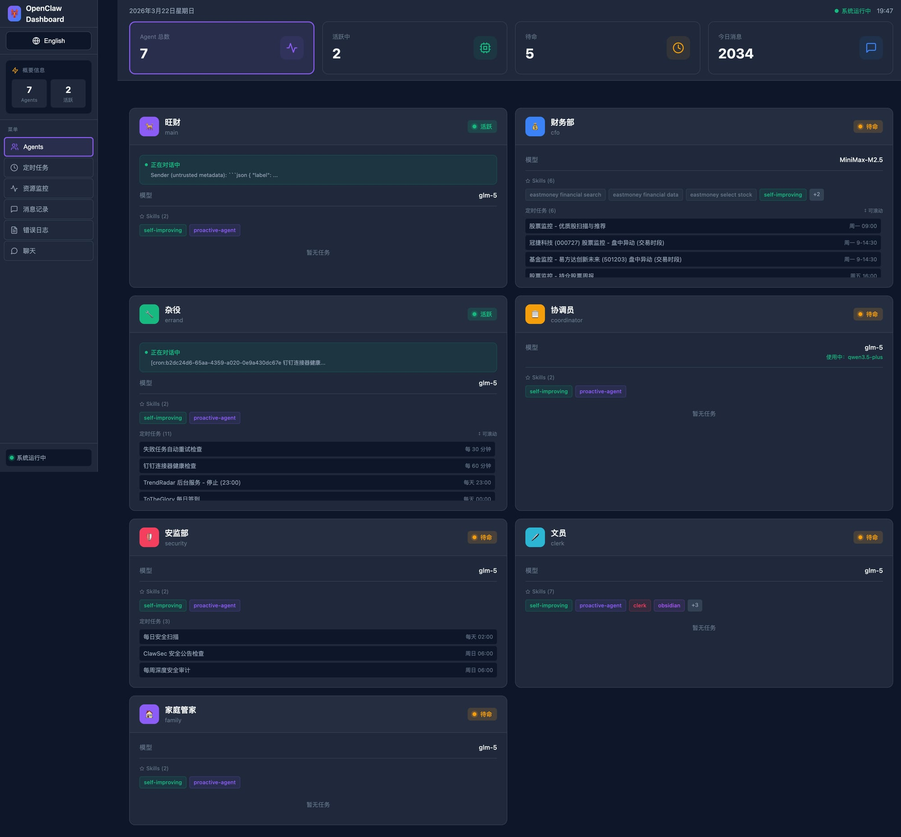
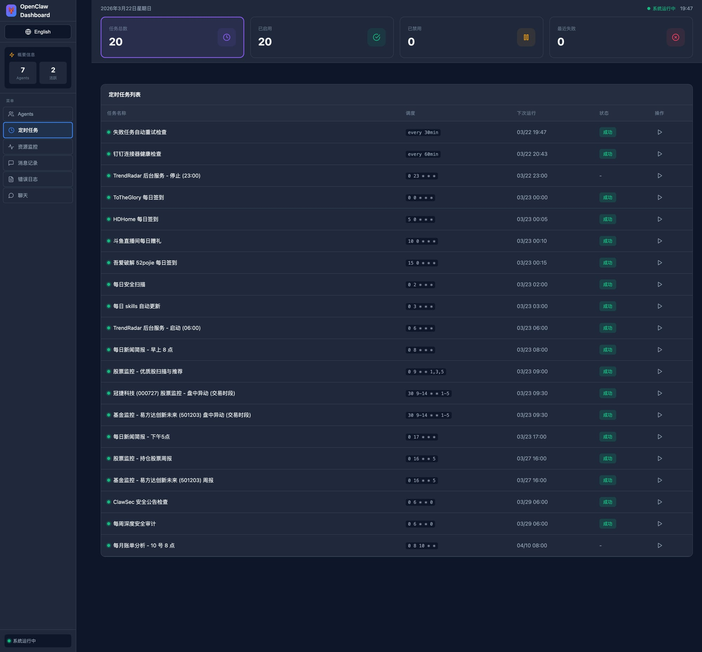
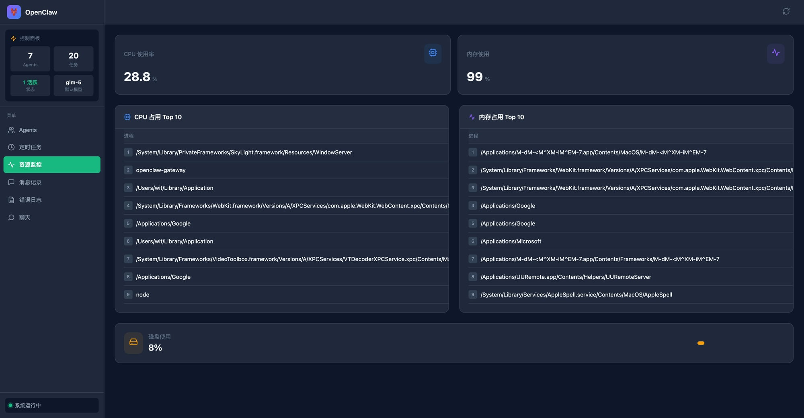

# OpenClaw Dashboard

OpenClaw 控制面板 - 一个现代化的 Web 界面，用于监控和管理 OpenClaw 系统。

## 功能特性

- **Agent 管理** - 查看所有 Agent 状态、Skills、定时任务、实时活动
- **定时任务** - 查看和管理 Cron 任务
- **资源监控** - 实时 CPU、内存、磁盘使用情况
- **消息记录** - 查看所有历史聊天消息
- **错误日志** - 查看系统错误和警告
- **聊天界面** - 与 Agent 对话

## 截图预览

### Agent 管理


### 定时任务


### 资源监控


## 技术栈

- **前端**: React + TypeScript + Vite
- **后端**: Express.js
- **样式**: 内联 CSS（暗色主题）
- **数据**: 读取 OpenClaw 文件系统

## 快速开始

### 1. 克隆项目

```bash
git clone https://github.com/your-username/openclaw-dashboard.git
cd openclaw-dashboard
```

### 2. 安装依赖

```bash
npm install
```

### 3. 配置环境变量

```bash
cp .env.example .env
```

编辑 `.env` 文件，配置 OpenClaw 路径：

```env
# OpenClaw 配置路径（默认 ~/.openclaw）
OPENCLAW_PATH=/Users/your-username/.openclaw

# 后端 API 端口
API_PORT=3100

# 前端端口
FRONTEND_PORT=3000
```

### 4. 启动服务

**开发模式**（同时启动前后端）：
```bash
npm run dev
```

**生产模式**：
```bash
npm run build
npm run start
```

**仅启动后端**：
```bash
npm run dev:server
```

**仅启动前端**：
```bash
npm run dev:client
```

### 5. 访问面板

打开浏览器访问：http://localhost:3000

## 项目结构

```
openclaw-dashboard/
├── server/                 # 后端 API
│   └── index.js           # Express 服务
├── src/                   # 前端源码
│   ├── api/              # API 调用
│   ├── components/       # React 组件
│   │   ├── agents/      # Agent 面板
│   │   ├── chat/        # 聊天面板
│   │   ├── cron/        # 定时任务面板
│   │   ├── layout/      # 布局组件
│   │   ├── logs/        # 日志面板
│   │   ├── messages/    # 消息面板
│   │   └── resources/   # 资源监控面板
│   ├── App.tsx          # 主组件
│   ├── main.tsx         # 入口
│   └── index.css        # 全局样式
├── .env.example         # 环境变量示例
├── package.json         # 项目配置
├── vite.config.ts       # Vite 配置
└── README.md            # 说明文档
```

## API 接口

| 接口 | 方法 | 说明 |
|------|------|------|
| `/api/health` | GET | 健康检查 |
| `/api/agents` | GET | 获取 Agent 列表 |
| `/api/cron` | GET | 获取定时任务 |
| `/api/resources` | GET | 获取资源使用情况 |
| `/api/processes` | GET | 获取 Top 进程 |
| `/api/messages/stats` | GET | 获取消息统计 |
| `/api/messages/today` | GET | 获取今日聊天内容 |

## 数据来源

Dashboard 从 OpenClaw 文件系统读取数据，**无需额外配置**：

| 数据 | 来源 | 说明 |
|------|------|------|
| **Agent 列表** | openclaw.json - agents.list | 自动获取所有 Agent |
| **Agent 名称** | agents.list[].identity.name | 中文名称 |
| **Agent Emoji** | agents.list[].identity.emoji | 显示图标 |
| **定时任务** | cron/jobs.json | 所有 Cron 任务 |
| **会话记录** | agents/*/sessions/*.jsonl | 消息历史 |
| **日志** | logs/gateway.err.log | 错误日志 |
| **Gateway 端口** | openclaw.json - gateway.port | 默认 18789 |

**无需硬编码任何用户特定信息，项目可通用部署。**

## 自定义开发

### 修改端口

编辑 `.env` 文件：
```env
API_PORT=3100
FRONTEND_PORT=3000
```

### 修改主题

编辑 `src/index.css` 中的 CSS 变量：
```css
:root {
  --bg-primary: #0f172a;
  --bg-secondary: #1e293b;
  --text-primary: #f8fafc;
  /* ... */
}
```

### 添加新面板

1. 在 `src/components/` 创建新组件
2. 在 `src/App.tsx` 添加路由
3. 在 `src/components/layout/Sidebar.tsx` 添加导航

## 部署

### Docker（推荐）

```bash
# 构建镜像
docker build -t openclaw-dashboard .

# 运行容器
docker run -p 3000:3000 \
  -v ~/.openclaw:/root/.openclaw:ro \
  openclaw-dashboard
```

### PM2

```bash
# 安装 PM2
npm install -g pm2

# 启动
pm2 start npm --name "openclaw-dashboard" -- run start

# 开机自启
pm2 startup
pm2 save
```

### Systemd

创建服务文件 `/etc/systemd/system/openclaw-dashboard.service`：

```ini
[Unit]
Description=OpenClaw Dashboard
After=network.target

[Service]
Type=simple
User=your-username
WorkingDirectory=/path/to/openclaw-dashboard
ExecStart=/usr/bin/npm run start
Restart=on-failure

[Install]
WantedBy=multi-user.target
```

```bash
sudo systemctl enable openclaw-dashboard
sudo systemctl start openclaw-dashboard
```

## 故障排查

### 端口被占用

```bash
# 查找占用进程
lsof -i :3100
lsof -i :3000

# 终止进程
kill -9 <PID>
```

### 磁盘空间显示与系统设置不同

**macOS 用户注意：**
- Dashboard 显示的是 df 命令返回的纯可用空间
- 系统设置的可用空间包含可清除空间（时间机器快照等可释放空间）
- 差异通常在 5-15GB，属于正常现象

**单位说明：**
- Dashboard 使用十进制 GB (1GB = 10^9 字节)
- 与系统设置显示的单位一致

### 无法读取 OpenClaw 数据

检查 `.env` 中的 `OPENCLAW_PATH` 是否正确：
```bash
# 验证路径
ls -la ~/.openclaw/openclaw.json
```

### 前端无法连接后端

检查后端是否运行：
```bash
curl http://localhost:3100/api/health
```

## 许可证

MIT License

## 贡献

欢迎提交 Issue 和 Pull Request！

## 相关项目

- [OpenClaw](https://github.com/openclaw/openclaw) - AI Agent 框架
- [ClawHub](https://clawhub.com) - Skills 市场